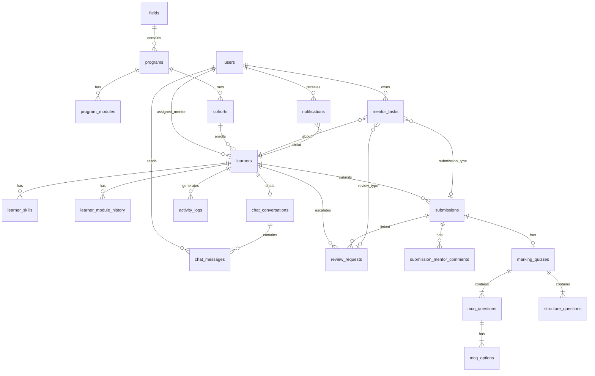
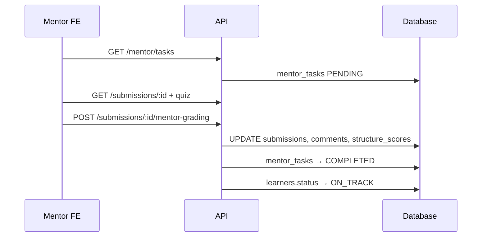
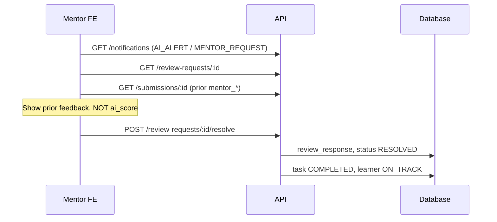

# Sinaptik Mentor Portal — Database Schema & FE Contract

This document defines the **database tables** the backend must implement to connect with the FE prototype, along with the **mentor workflow** and API mapping.

---

## 1. Mentor daily workflow (FE flow)

```
Morning
  Dashboard → board (who is stuck / needs review?)
           → Tasks → grade PENDING submissions
           → Notifications → handle AI alerts

During the day
  Marking → save structure scores + comments
         → auto: task COMPLETED + learner ON_TRACK

Learner escalates
  Notification → Requested Review
              → view prior mentor feedback (from submission)
              → save review_response

Follow-up
  Learners (?status=PENDING_MENTOR) → Profile → Chat
```

---

## 2. ER diagram



---

## 3. Enums

| Enum | Values |
|------|--------|
| `user_role` | `MENTOR`, `LEARNER` |
| `learner_status` | `ON_TRACK`, `PENDING_MENTOR`, `AT_RISK`, `STUCK`, `COMPLETED` |
| `drop_off_risk` | `None`, `Low`, `Medium`, `High`, `Critical` |
| `module_status` | `COMPLETED`, `IN_PROGRESS`, `LOCKED` |
| `task_type` | `SUBMISSION`, `REVIEW_REQUEST` |
| `task_status` | `PENDING`, `COMPLETED` |
| `review_request_status` | `OPEN`, `RESOLVED` |
| `notification_type` | `SUBMISSION`, `MENTOR_REQUEST`, `AI_ALERT`, `SYSTEM`, `CHAT` |
| `activity_type` | `AI_ALERT`, `MENTOR_REQUEST`, `SUBMISSION`, `SYSTEM` |
| `sender_role` | `MENTOR`, `LEARNER` |

---

## 4. Database tables (detail)

### 4.1 `users`

| Column | Type | Constraints | Notes |
|--------|------|-------------|-------|
| `id` | VARCHAR(36) | PK | `m1`, `l1` |
| `name` | VARCHAR(255) | NOT NULL | |
| `role` | user_role | NOT NULL | |
| `avatar_url` | TEXT | | |
| `email` | VARCHAR(255) | UNIQUE, nullable | Auth phase 2 |
| `created_at` | TIMESTAMPTZ | NOT NULL | |
| `updated_at` | TIMESTAMPTZ | NOT NULL | |

---

### 4.2 `fields`

| Column | Type | Constraints | Notes |
|--------|------|-------------|-------|
| `id` | VARCHAR(36) | PK | `data-analytics` |
| `name` | VARCHAR(255) | NOT NULL | Course catalog grouping |
| `sort_order` | INT | DEFAULT 0 | |

---

### 4.3 `programs`

| Column | Type | Constraints | Notes |
|--------|------|-------------|-------|
| `id` | VARCHAR(36) | PK | `bootcamp-da` |
| `field_id` | VARCHAR(36) | FK → fields | |
| `name` | VARCHAR(255) | NOT NULL | |
| `description` | TEXT | | |
| `duration_weeks` | INT | | |
| `primary_mentor_id` | VARCHAR(36) | FK → users | Catalog display |

---

### 4.4 `program_modules`

| Column | Type | Constraints | Notes |
|--------|------|-------------|-------|
| `id` | VARCHAR(36) | PK | |
| `program_id` | VARCHAR(36) | FK → programs | |
| `title` | VARCHAR(255) | NOT NULL | |
| `sort_order` | INT | NOT NULL | |

---

### 4.5 `cohorts`

| Column | Type | Constraints | Notes |
|--------|------|-------------|-------|
| `id` | VARCHAR(36) | PK | `c7` |
| `program_id` | VARCHAR(36) | FK → programs | |
| `name` | VARCHAR(255) | NOT NULL | Batch label |
| `start_date` | DATE | | |
| `total_modules` | INT | NOT NULL | |
| `total_learners` | INT | NOT NULL | Cohort size (186) |
| `completion_rate` | DECIMAL(5,2) | | Dashboard KPI |
| `avg_score` | DECIMAL(5,2) | | Dashboard KPI |
| `avg_response_time_hours` | DECIMAL(6,2) | nullable | Ops metric |
| `active_this_week` | INT | nullable | Ops metric |

> `at_risk_count`, `pending_review_count` — **derive** from `learners`; no separate columns needed.

---

### 4.6 `cohort_mentors`

Mentors assigned to a cohort / course (e.g. Puja has 21/186 learners).

| Column | Type | Constraints | Notes |
|--------|------|-------------|-------|
| `cohort_id` | VARCHAR(36) | FK → cohorts | |
| `mentor_id` | VARCHAR(36) | FK → users | |
| | | PK (cohort_id, mentor_id) | |

---

### 4.7 `learners`

| Column | Type | Constraints | Notes |
|--------|------|-------------|-------|
| `id` | VARCHAR(36) | PK | FK → users.id (1:1 learner user) |
| `cohort_id` | VARCHAR(36) | FK → cohorts | |
| `program_id` | VARCHAR(36) | FK → programs | |
| `assigned_mentor_id` | VARCHAR(36) | FK → users | Filter roster |
| `status` | learner_status | NOT NULL | Board column source |
| `current_module` | VARCHAR(255) | | Display label |
| `enrollment_label` | VARCHAR(255) | | |
| `module_progress` | INT | NOT NULL | Modules completed count |
| `total_modules` | INT | NOT NULL | |
| `last_active_at` | TIMESTAMPTZ | | |
| `avg_score` | DECIMAL(5,2) | | |
| `engagement_score` | DECIMAL(5,2) | | |
| `drop_off_risk` | drop_off_risk | NOT NULL | |

**Board mapping (FE):**

| `status` | Dashboard column |
|----------|------------------|
| `STUCK`, `AT_RISK` | Stuck / at risk |
| `PENDING_MENTOR` | Needs review |
| `ON_TRACK`, `COMPLETED` | On track |

---

### 4.8 `learner_skills`

| Column | Type | Constraints | Notes |
|--------|------|-------------|-------|
| `id` | VARCHAR(36) | PK | |
| `learner_id` | VARCHAR(36) | FK → learners | |
| `name` | VARCHAR(100) | NOT NULL | |
| `progress` | DECIMAL(5,2) | NOT NULL | 0–100, profile chart |

---

### 4.9 `learner_module_history`

| Column | Type | Constraints | Notes |
|--------|------|-------------|-------|
| `id` | VARCHAR(36) | PK | |
| `learner_id` | VARCHAR(36) | FK → learners | |
| `module_id` | VARCHAR(36) | FK → program_modules | nullable |
| `title` | VARCHAR(255) | NOT NULL | |
| `status` | module_status | NOT NULL | |
| `score` | DECIMAL(5,2) | nullable | |

---

### 4.10 `submissions`

| Column | Type | Constraints | Notes |
|--------|------|-------------|-------|
| `id` | VARCHAR(36) | PK | |
| `learner_id` | VARCHAR(36) | FK → learners | |
| `course_id` | VARCHAR(36) | FK → programs | |
| `module_title` | VARCHAR(255) | NOT NULL | |
| `assignment_title` | VARCHAR(255) | NOT NULL | |
| `content` | TEXT | NOT NULL | Code / essay |
| `ai_score` | DECIMAL(5,2) | | Stored in DB, **not shown** on Marking UI |
| `ai_feedback` | TEXT | | Analytics only |
| `submitted_at` | TIMESTAMPTZ | NOT NULL | |
| `mentor_score` | DECIMAL(5,2) | nullable | Structure total |
| `mentor_score_max` | DECIMAL(5,2) | nullable | |
| `mentor_feedback` | TEXT | nullable | Summary comment |
| `mentor_marked_at` | TIMESTAMPTZ | nullable | |
| `mentor_id` | VARCHAR(36) | FK → users | Who graded |

---

### 4.11 `submission_mentor_comments`

| Column | Type | Constraints | Notes |
|--------|------|-------------|-------|
| `id` | VARCHAR(36) | PK | |
| `submission_id` | VARCHAR(36) | FK → submissions | |
| `author_id` | VARCHAR(36) | FK → users | |
| `text` | TEXT | NOT NULL | May contain `@mention` |
| `selected_text` | TEXT | nullable | Highlight anchor |
| `created_at` | TIMESTAMPTZ | NOT NULL | |

---

### 4.12 `marking_quizzes`

One quiz payload per submission (Marking page).

| Column | Type | Constraints | Notes |
|--------|------|-------------|-------|
| `id` | VARCHAR(36) | PK | |
| `submission_id` | VARCHAR(36) | FK → submissions, UNIQUE | |

---

### 4.13 `mcq_questions`

| Column | Type | Constraints | Notes |
|--------|------|-------------|-------|
| `id` | VARCHAR(36) | PK | |
| `quiz_id` | VARCHAR(36) | FK → marking_quizzes | |
| `number` | INT | NOT NULL | |
| `prompt` | TEXT | NOT NULL | |
| `correct_option_id` | VARCHAR(36) | NOT NULL | Auto-grade |
| `selected_option_id` | VARCHAR(36) | NOT NULL | Learner answer |

---

### 4.14 `mcq_options`

| Column | Type | Constraints | Notes |
|--------|------|-------------|-------|
| `id` | VARCHAR(36) | PK | |
| `question_id` | VARCHAR(36) | FK → mcq_questions | |
| `label` | TEXT | NOT NULL | Option text |

---

### 4.15 `structure_questions`

| Column | Type | Constraints | Notes |
|--------|------|-------------|-------|
| `id` | VARCHAR(36) | PK | |
| `quiz_id` | VARCHAR(36) | FK → marking_quizzes | |
| `number` | INT | NOT NULL | |
| `prompt` | TEXT | NOT NULL | |
| `answer` | TEXT | NOT NULL | Learner essay answer |
| `max_score` | DECIMAL(5,2) | NOT NULL | Usually 10 |
| `mentor_score` | DECIMAL(5,2) | nullable | Filled on Mark |

---

### 4.16 `review_requests`

| Column | Type | Constraints | Notes |
|--------|------|-------------|-------|
| `id` | VARCHAR(36) | PK | |
| `learner_id` | VARCHAR(36) | FK → learners | |
| `submission_id` | VARCHAR(36) | FK → submissions | Prior marking source |
| `student_message` | TEXT | NOT NULL | Escalation question |
| `status` | review_request_status | NOT NULL | |
| `review_response` | TEXT | nullable | **Separate** from submission feedback |
| `created_at` | TIMESTAMPTZ | NOT NULL | |
| `resolved_at` | TIMESTAMPTZ | nullable | |
| `resolved_by` | VARCHAR(36) | FK → users | nullable |

---

### 4.17 `mentor_tasks`

Work queue — core operational table.

| Column | Type | Constraints | Notes |
|--------|------|-------------|-------|
| `id` | VARCHAR(36) | PK | |
| `mentor_id` | VARCHAR(36) | FK → users | |
| `type` | task_type | NOT NULL | |
| `course_id` | VARCHAR(36) | FK → programs | |
| `course_name` | VARCHAR(255) | NOT NULL | Denormalized OK |
| `module_title` | VARCHAR(255) | NOT NULL | |
| `assignment_title` | VARCHAR(255) | NOT NULL | |
| `learner_id` | VARCHAR(36) | FK → learners | |
| `learner_name` | VARCHAR(255) | NOT NULL | Denormalized OK |
| `submission_id` | VARCHAR(36) | FK → submissions, nullable | When type=SUBMISSION |
| `review_request_id` | VARCHAR(36) | FK → review_requests, nullable | When type=REVIEW_REQUEST |
| `due_date` | DATE | NOT NULL | Calendar dot |
| `status` | task_status | NOT NULL | |
| `submitted_at` | TIMESTAMPTZ | nullable | |

---

### 4.18 `notifications`

| Column | Type | Constraints | Notes |
|--------|------|-------------|-------|
| `id` | VARCHAR(36) | PK | |
| `mentor_id` | VARCHAR(36) | FK → users | Recipient |
| `type` | notification_type | NOT NULL | Color on FE |
| `learner_id` | VARCHAR(36) | FK → learners | |
| `learner_name` | VARCHAR(255) | NOT NULL | |
| `message` | TEXT | NOT NULL | |
| `date` | DATE | NOT NULL | |
| `read` | BOOLEAN | DEFAULT false | |
| `requires_action` | BOOLEAN | DEFAULT false | |
| `submission_id` | VARCHAR(36) | FK → submissions, nullable | Deep link |
| `review_request_id` | VARCHAR(36) | FK → review_requests, nullable | Deep link |

---

### 4.19 `chat_conversations`

| Column | Type | Constraints | Notes |
|--------|------|-------------|-------|
| `id` | VARCHAR(36) | PK | |
| `learner_id` | VARCHAR(36) | FK → learners, UNIQUE | One per learner |
| `mentor_id` | VARCHAR(36) | FK → users | |
| `course_label` | VARCHAR(255) | | |
| `last_message` | TEXT | | Denormalized preview |
| `last_message_at` | TIMESTAMPTZ | | |
| `unread_count` | INT | DEFAULT 0 | |

---

### 4.20 `chat_messages`

| Column | Type | Constraints | Notes |
|--------|------|-------------|-------|
| `id` | VARCHAR(36) | PK | |
| `conversation_id` | VARCHAR(36) | FK → chat_conversations | |
| `sender_id` | VARCHAR(36) | FK → users | |
| `sender_role` | sender_role | NOT NULL | |
| `text` | TEXT | NOT NULL | |
| `timestamp` | TIMESTAMPTZ | NOT NULL | |

---

### 4.21 `activity_logs`

Timeline on Learner Profile.

| Column | Type | Constraints | Notes |
|--------|------|-------------|-------|
| `id` | VARCHAR(36) | PK | |
| `learner_id` | VARCHAR(36) | FK → learners | |
| `type` | activity_type | NOT NULL | |
| `message` | TEXT | NOT NULL | |
| `timestamp` | TIMESTAMPTZ | NOT NULL | |
| `requires_action` | BOOLEAN | DEFAULT false | |

---

## 5. Dashboard data (read-only aggregates)

FE Dashboard **does not need 4 charts**. BE returns `GET /mentor/dashboard`:

```json
{
  "cohort": { "name": "...", "completionRate": 52.4, "avgScore": 45, "totalLearners": 186 },
  "actions": {
    "pendingSubmissions": 4,
    "pendingReviewRequests": 1,
    "unreadAiAlerts": 1,
    "pendingMentorLearners": 4,
    "stuckOrAtRisk": 6
  },
  "board": {
    "stuck": ["learner ids..."],
    "needs_review": ["..."],
    "on_track": ["..."]
  }
}
```

| Metric | SQL source |
|--------|------------|
| `pendingSubmissions` | `mentor_tasks` WHERE type=SUBMISSION AND status=PENDING |
| `pendingReviewRequests` | `mentor_tasks` WHERE type=REVIEW_REQUEST AND status=PENDING |
| `unreadAiAlerts` | `notifications` WHERE type=AI_ALERT AND read=false |
| `pendingMentorLearners` | `learners` WHERE status=PENDING_MENTOR |
| `stuckOrAtRisk` | `learners` WHERE status IN (STUCK, AT_RISK) |
| Board columns | Group `learners` by status mapping above |

> Charts (`weekly_engagement`, `score_distribution`, `module_completion`, `skill_averages`) — **phase 2 / admin analytics**; not required for the mentor workflow.

---

## 6. API map (FE route → endpoint)

| FE Route | GET | POST / PATCH |
|----------|-----|--------------|
| `/` | `GET /mentor/dashboard` | — |
| `/tasks` | `GET /mentor/tasks?mentor_id=` | `PATCH /mentor/tasks/:id` |
| `/marking/:id` | `GET /submissions/:id`, `GET /marking-quizzes/:submissionId` | `POST /submissions/:id/mentor-grading` |
| `/review/:id` | `GET /review-requests/:id`, `GET /submissions/:submissionId` | `POST /review-requests/:id/resolve` |
| `/notifications` | `GET /notifications?mentor_id=` | `PATCH /notifications/:id/read` |
| `/learners` | `GET /learners?mentor_id=&status=` | — |
| `/learners/:id` | `GET /learners/:id`, `GET /activity-logs?learner_id=` | `PATCH /learners/:id/status` |
| `/chat/:learnerId` | `GET /conversations`, `GET /messages` | `POST /conversations/:id/messages` |
| `/programs` | `GET /programs`, `GET /fields` | — |

---

## 7. Write operations & side effects

### 7.1 `POST /submissions/:id/mentor-grading`

**Body:** `mentor_score`, `mentor_score_max`, `mentor_feedback`, `comments[]`, `structure_scores[]`

**Side effects:**
1. UPDATE `submissions` (mentor_* fields)
2. INSERT `submission_mentor_comments`
3. UPDATE `structure_questions.mentor_score`
4. UPDATE `mentor_tasks` SET status=COMPLETED WHERE submission_id=:id
5. UPDATE `learners` SET status=ON_TRACK WHERE id=learner_id
6. UPDATE `activity_logs` SET requires_action=false for learner

### 7.2 `POST /review-requests/:id/resolve`

**Body:** `review_response`, optional `comments[]`

**Side effects:**
1. UPDATE `review_requests` SET status=RESOLVED, review_response, resolved_at
2. UPDATE `mentor_tasks` SET status=COMPLETED WHERE review_request_id=:id
3. UPDATE `learners` SET status=ON_TRACK
4. Mark related `notifications` read

### 7.3 `PATCH /notifications/:id/read`

UPDATE `notifications.read = true`

### 7.4 Event triggers (BE creates rows)

| Event | Creates |
|-------|---------|
| Learner submits assignment | `submissions`, `marking_quizzes`, `mentor_tasks` (SUBMISSION), `notifications` (SUBMISSION) |
| Learner escalates | `review_requests`, `mentor_tasks` (REVIEW_REQUEST), `notifications` (MENTOR_REQUEST) |
| AI detects risk | `notifications` (AI_ALERT), optional UPDATE `learners.drop_off_risk` |
| Mentor grades | See 7.1 |
| Mentor resolves review | See 7.2 |

---

## 8. Sequence diagrams

### Marking



### Review escalation



---

## 9. Recommended indexes

```sql
CREATE INDEX idx_learners_mentor_status ON learners(assigned_mentor_id, status);
CREATE INDEX idx_mentor_tasks_mentor_due ON mentor_tasks(mentor_id, due_date, status);
CREATE INDEX idx_notifications_mentor_read ON notifications(mentor_id, read, date DESC);
CREATE INDEX idx_submissions_learner ON submissions(learner_id, submitted_at DESC);
CREATE INDEX idx_review_requests_status ON review_requests(status, created_at DESC);
```

---

## 10. FE file reference

| File | Role |
|------|------|
| `src/types/index.ts` | TypeScript interfaces |
| `src/data/mock_data.json` | Sample payloads |
| `src/context/AppContext.tsx` | Client-side mutations mirroring API |
| `src/pages/mentor/MentorDashboardPage.tsx` | Triage board + action cards |
| `src/pages/mentor/MentorTasksPage.tsx` | Work queue |
| `src/pages/mentor/MarkingPage.tsx` | Grading |
| `src/pages/mentor/RequestedReviewPage.tsx` | Escalation reply |
| `src/pages/mentor/MentorNotificationsPage.tsx` | Inbox |
| `src/pages/mentor/MentorLearnersPage.tsx` | Roster + status filter |
