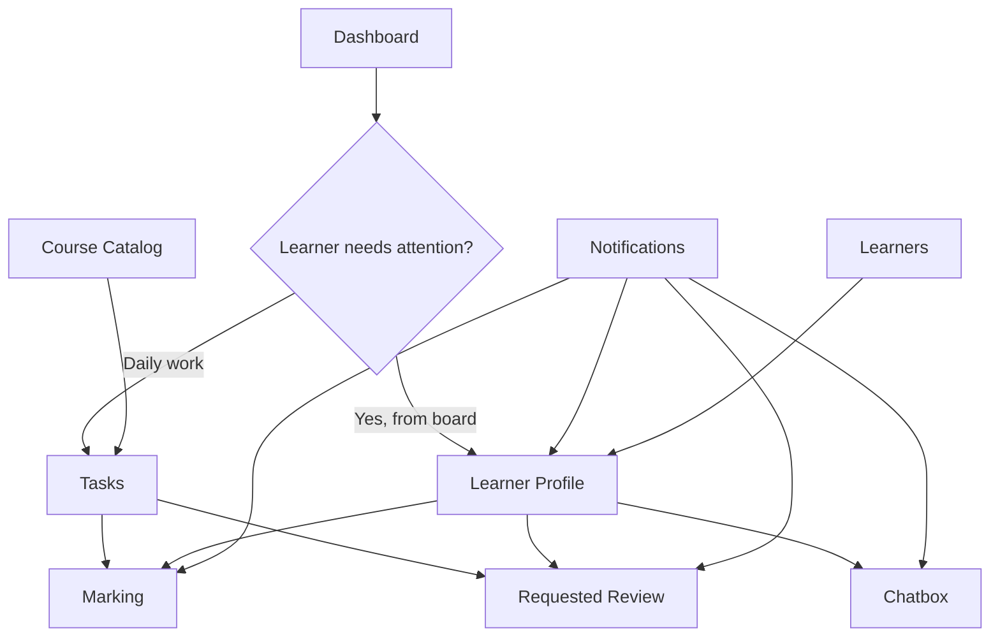

# Sinaptik Mentor Portal — Page Specification (Prototype)

This document describes the intended page structure, features, and user flows for the Sinaptik mentor prototype. It is based on the product owner's page order and is meant for review before frontend and mock-data updates.

**Primary persona:** Mentor (instructor) who may teach one or more courses and needs a single place to monitor learners, grade work, respond to review requests, and communicate with students.

**Suggested route map (for implementation):**

| # | Page | Route |
|---|------|-------|
| 1 | Dashboard | `/` |
| 2 | Tasks | `/tasks` |
| 3 | Marking | `/marking/:submissionId` |
| 4 | Requested Review | `/review/:requestId` |
| 5 | Learners | `/learners` |
| 6 | Learner Profile | `/learners/:learnerId` |
| 7 | Chatbox | `/chat` (or `/chat/:learnerId`) |
| 8 | Notifications | `/notifications` |
| 9 | Course Catalog | `/programs` |

---

## Figma design alignment (reviewed Jul 2026)

Comparison of the Figma mockups against this spec and the current codebase.

### Global shell (all mentor pages)

| Element | Figma | Spec | Status |
|---------|-------|------|--------|
| Mentor identity | Puja Pramudya · Data Analytics Bootcamp — Batch 7 (2026) | Mentor persona | ✅ Match |
| Sidebar nav | Dashboard, Tasks, Learners, Notifications, Course Catalog | Same 5 items (Chatbox not in sidebar) | ✅ Match — **update spec**: Chatbox is header-only |
| Sidebar badges | Dashboard **26**, Tasks **3**, Notifications **5** | Tasks + Notifications badges | ✅ Match |
| Header icons | Chat, Notifications bell, Profile avatar | Chatbox + Notifications | ✅ Match |
| Cohort size | **186** learners total, **21** under Puja | Multi-course mentor | ✅ Match |

### Page-by-page

| Page | Figma | Spec | Gap / action |
|------|-------|------|--------------|
| **1. Dashboard** | 2 KPI cards only (52.4%, 45/100); 4 charts; 3-column board | Same structure | ⚠️ Code still shows 6 stat cards + alerts panel — trim in FE pass |
| **2. Tasks** | Calendar (Jul 2026) + grouped todo + **Request Review** section; 2 courses | Course → Module → Assignment + separate student requests | ✅ Match — requests live inside Tasks page in Figma |
| **3. Marking** | Not in Figma set | Inline highlight + @mentions | ⏳ No Figma yet — keep spec |
| **4. Requested Review** | Folded into Tasks "Request Review" group | Separate page | ⚠️ Figma groups under Tasks; can share route with `?type=review` |
| **5. Learners** | Table: Name, Module, Status, Score, Risk, Last Active, View; search + sort | Search + filter by status | ✅ Match — add Score + Risk columns in FE |
| **6. Learner Profile** | Name + message icon; enrollment; Pending Mentor + drop-off risk; 3 metrics; Learning snapshot + Modules visited | Profile + metrics + charts | ✅ Match — Figma drops activity timeline from visible fold (keep in spec) |
| **7. Chatbox** | Full-screen overlay; learner list + thread; sample Puja ↔ Sari conversation | Chat list + messages | ✅ Match — accessed via header, not sidebar |
| **8. Notifications** | Titled **"Inbox"**; tabs: All / Mentor Request / Assignment Submission | Unified notification center | ✅ Match — label nav "Notifications", page title "Inbox" |
| **9. Course Catalog** | Grouped by field; active cohort badge on bootcamp; module lists | Sinaptik catalog | ✅ Match |

### Resolved from Figma (formerly open questions)

1. **Dashboard KPIs:** Exactly **2 cards** (completion rate + average score).
2. **Alerts vs Notifications:** **Merge** — no separate Alerts nav; use Notifications / Inbox only.
3. **Marking vs Requested Review:** **Same grading component**, different entry context (task type `submission` vs `review_request`).
4. **Chatbox:** **Header icon only**, not sidebar — phase 1 included.
5. **Course catalog route:** `/programs`; display label **Course Catalog**. Legacy `/mentor/*` paths redirect to the routes above.

### Mock data anchors (from Figma)

| Key | Value |
|-----|-------|
| Demo mentor | Puja Pramudya (`m1`) |
| Primary cohort | Data Analytics Bootcamp — Batch 7 (2026) · 186 learners |
| Puja's learners | 21 |
| Dashboard KPIs | Completion 52.4% · Avg score 45/100 |
| Featured learner | Sari Dewi — Pending Mentor, Mod 4, score 45, engagement 68, progress 50%, drop-off High |
| Second course | Data Science — Batch 5 (2026) |
| Task courses | Bootcamp Batch 7 + Data Science Batch 5 |
| Board samples | Stuck: Santoso, Udin · Review: Dewi, Pratama · On track: Wijaya, Sari |

---

## 1. Dashboard (Home)

### Purpose

The mentor's landing page. It surfaces cohort-level performance metrics and a triage board so mentors can quickly see who needs attention without opening multiple tools.

### Primary user

Mentor monitoring student performance across one or more courses they teach.

### Layout & components

#### A. Summary stat cards (top row)

Two primary KPI cards:

| Card | Description |
|------|-------------|
| **Completion rate** | Percentage of learners who have completed their current module or program milestone (configurable scope: mentor's learners vs full cohort). |
| **Average score** | Mean AI-graded or mentor-confirmed score across recent submissions. |

> **Note:** The current prototype also shows extra stats (at risk, pending review, avg response time, active this week). Confirm whether the dashboard should be limited to exactly 2 cards per this spec, or whether those extras remain as secondary metrics.

#### B. Analytics charts (four charts, in order)

1. **Weekly engagement** — Bar or grouped bar chart showing logins and/or submissions per day over the past week.
2. **Module completion** — Horizontal bar chart: each module vs number of learners who completed it.
3. **Score distribution** — Histogram or vertical bar chart: count of submissions per score range (e.g. 0–49, 50–69, 70–89, 90–100).
4. **Cohort skill averages** — Horizontal bar chart: average proficiency per skill area (e.g. Data Wrangling, Machine Learning).

#### C. Learner progress board (bottom)

A Kanban-style board with **three columns**:

| Column | Meaning | Typical learner statuses |
|--------|---------|--------------------------|
| **Stuck / at risk** | Learners who are inactive, falling behind, or flagged by AI as high drop-off risk. | `STUCK`, `AT_RISK` |
| **Needs review** | Learners waiting on mentor action (submitted work, escalated from AI, or review request). | `PENDING_MENTOR` |
| **On track** | Learners progressing normally with no open mentor actions. | `ON_TRACK`, optionally `COMPLETED` |

Each **learner card** should show at minimum:

- Name and avatar
- Current module
- Status tag (e.g. Pending mentor, On track)
- Assigned mentor avatar (ownership trail when multiple mentors exist)

Clicking a card navigates to **Learner Profile** (page 6).

### User flow

```
Mentor logs in
  → Lands on Dashboard
  → Scans completion rate + average score
  → Reviews charts for trends (engagement drop, low scores, skill gaps)
  → Opens Learner progress board
  → Clicks a learner in "Needs review" or "Stuck / at risk"
  → Goes to Learner Profile or directly to Marking / Requested Review
```

### Data requirements (mock)

- `dashboardAnalytics`: weekly engagement, module completion, score distribution, skill averages
- `learners[]` with status, current module, assigned mentor
- Aggregated completion rate and average score (computed or pre-stored)

### Interactions

- Learner cards are clickable → Learner Profile
- Optional: filter dashboard by course if mentor teaches multiple courses
- Charts are read-only in prototype (no drill-down required unless specified later)

---

## 2. Tasks

### Purpose

A daily work queue for mentors. Combines **scheduled grading tasks** (submissions due for review on a selected date) with **student-initiated review requests** in one place.

### Primary user

Mentor planning their day: what to grade today and which students asked for help.

### Layout & components

#### A. Calendar + daily task list

- **Calendar** (month or week view): mentor selects a date.
- **Todo list for selected date**: items grouped hierarchically:

```
Course name
  └── Module name
        └── Assignment — [Student name] — [submitted at] — [status]
```

- A mentor may teach **one or many courses**; the task list must support **at least 1 course with no upper limit**.
- Each task item represents a **normal submission** awaiting standard mentor grading (not a special "requested review" escalation — those go in section B).
- Clicking a task opens **Marking** (page 3) for that submission.

**Task item fields:**

| Field | Example |
|-------|---------|
| Course | Data Science Bootcamp |
| Module | M3: Data Wrangling |
| Assignment | Clean missing values exercise |
| Student | Sarah Jenkins |
| Submitted | 2 hours ago |
| Status | Pending grading |

#### B. Student requests (sidebar or bottom section)

A separate list titled **Student requests** (or similar):

| Field | Description |
|-------|-------------|
| Student name | Who requested the review |
| Assignment / module | What work they want reviewed |
| Request snippet | Short preview of their question (optional) |
| Time | When the request was sent |

Clicking an item opens **Requested Review** (page 4), not Marking.

### User flow

```
Mentor opens Tasks
  → Calendar defaults to today
  → Reviews todo list: Course → Module → Assignment submissions
  → Clicks a submission → Marking page
  → OR scrolls to Student requests
  → Clicks a request → Requested Review page
```

### Data requirements (mock)

- `courses[]` — mentor may be linked to multiple course IDs
- `tasks[]` or derived from `submissions[]` with: `courseId`, `moduleId`, `assignmentTitle`, `learnerId`, `dueDate` / `submittedAt`, `status`
- `reviewRequests[]` — student name, assignment reference, request message, `learnerId`, `submissionId`, timestamp

### Interactions

- Date selection on calendar refreshes the todo list
- Optional filters: by course, by status (pending / in progress / done)
- Badge on nav item showing count of today's pending tasks + open student requests

---

## 3. Marking

### Purpose

The standard grading workspace. Mentor reviews a student's submitted assignment, leaves inline feedback on the work itself, and can mention people in comments.

### Primary user

Mentor grading a normal submission (from Tasks todo list or Learner Profile).

### Layout & components

#### A. Submission workspace (main area)

- Assignment title and module/course context (breadcrumb: Course → Module → Assignment)
- Student name and submission timestamp
- **Student work** displayed as text/code block (read-only for mentor)
- **Text selection / highlight** on student work triggers an in-context comment UI

#### B. In-context commenting

- Mentor highlights a passage in the submission
- A comment box appears anchored near the selection
- Comment supports **`@mentions`**: typing `@` opens a dropdown of:
  - The **student** (submission author)
  - **Other mentors** (collaborators on the course/cohort)
- Posted comments remain visually tied to the highlighted text
- Comment thread may also show in a sidebar list for navigation

#### C. AI context panel (recommended sidebar)

- AI-generated score and reasoning from auto-grading (so mentor has context before overriding or supplementing)
- Not required to block marking if AI data is missing in prototype

#### D. Actions

| Action | Behavior |
|--------|----------|
| **Save draft** | Persist comments without finalizing (optional in prototype) |
| **Submit feedback** | Sends feedback to learner; updates submission status |
| **Mark as resolved** | Closes the grading task; learner status returns to on track |

### User flow

```
Mentor arrives from Tasks (or Learner Profile → Review submission)
  → Reads student submission
  → Highlights incorrect or unclear section
  → Adds comment with optional @student or @mentor
  → Repeats for other sections
  → Submits feedback / marks resolved
  → Returns to Tasks or Dashboard; learner notified
```

### Data requirements (mock)

- `submissions[]`: content, aiScore, aiFeedback, learnerId, moduleTitle, courseId
- `comments[]`: text, selectedText, offset/anchor, mentions[], authorId, createdAt
- `mentionables[]`: learners + mentors for @ dropdown

### Distinction from Requested Review

| | Marking | Requested Review |
|---|---------|------------------|
| Trigger | Normal submission in task queue | Student clicked "Request mentor review" after AI feedback |
| Student question | Not required | Required — student explains what they don't understand |
| Mentor reply | Inline comments on work | Dedicated answer field for the student's question |

---

## 4. Requested Review

### Purpose

A dedicated view for escalations: when a student disagrees with or does not understand AI feedback and explicitly asks a mentor for help.

### Primary user

Mentor responding to a student-initiated review request (from Tasks → Student requests, Notifications, or Learner Profile).

### Layout & components

The page is split into clear sections (stacked or two-column):

#### A. Student submission

- Full assignment work (same content as Marking)
- Read-only display

#### B. Mentor grading / prior feedback

- AI score and detailed AI feedback (what the student already saw)
- Any prior mentor comments if the submission was partially reviewed

#### C. Student's review request

- **Question / confusion block**: the text the student entered when escalating (e.g. "I don't understand why dropping nulls is bad here")
- Timestamp and student name

#### D. Mentor response

- A dedicated **reply textarea** (not only inline highlights) for answering the student's question
- Optional: still allow inline highlights + comments on the submission (same @mention behavior as Marking)
- **Submit response** button
- **Mark as resolved** when the mentor considers the issue closed

### User flow

```
Student (learner portal) submits work → gets AI feedback → clicks "Request mentor review"
  → Enters question in modal → request appears in mentor Tasks + Notifications

Mentor opens Requested Review
  → Reads submission + AI feedback + student question
  → Writes answer in mentor response field (and/or inline comments)
  → Submits → student sees response; status updates to on track
```

### Data requirements (mock)

- `reviewRequests[]`: id, learnerId, submissionId, studentMessage, status (`OPEN` | `RESOLVED`), createdAt
- `mentorResponses[]`: requestId, text, authorId, createdAt
- Link to existing `submissions[]` and AI evaluation data

---

## 5. Learners

### Purpose

A searchable, filterable directory of all learners under the mentor (or cohort), with AI-assisted grouping to surface who needs attention.

### Primary user

Mentor who wants a list view (vs Kanban on Dashboard) to find and compare learners.

### Layout & components

#### A. AI insights summary (top banner or cards)

AI-generated or rule-based analysis highlighting:

| Insight | Description |
|---------|-------------|
| **Stuck** | Count + short list of learners inactive or flagged |
| **On track** | Learners progressing normally |
| **Completed** | Learners who finished the program or all modules |
| **Pending mentor** | Learners with open grading or review requests |

This can be presented as summary chips, a short narrative ("3 learners stuck, 2 pending your review"), or mini stat cards.

#### B. Search & filters

| Control | Behavior |
|---------|----------|
| **Search** | By learner name (and optionally email/id in full product) |
| **Status filter** | All, On track, Pending mentor, At risk, Stuck, Completed |
| **Course filter** | If mentor teaches multiple courses |
| **Sort** | Default, priority (stuck/at risk first), last active, name |

#### C. Learner table or list

Each row shows:

- Avatar, name
- Current course / program
- Current module
- Status badge
- Last active
- Avg score or progress %
- Link/action → **Learner Profile**

### User flow

```
Mentor opens Learners
  → Reads AI summary at top
  → Filters by "Pending mentor"
  → Searches for a specific student
  → Clicks row → Learner Profile
```

### Data requirements (mock)

- `learners[]` with full status, course assignment, metrics
- Optional `aiLearnerInsights` object with counts and top names per category

---

## 6. Learner Profile

### Purpose

Detailed view of a single learner: identity, enrollment, performance metrics, activity history, and a quick path to message them.

### Primary user

Mentor gathering context before grading or messaging.

### Layout & components

#### A. Header

- Learner name and avatar
- **Message icon** — opens **Chatbox** (page 7) with this learner pre-selected
- Status badge and assigned mentor

#### B. Enrollment & progress

- **Current course(s)** the learner is enrolled in
- Current module and module progress (e.g. 4/12 modules)
- Completion rate, average score, engagement score (key metrics)

#### C. Skill breakdown

- Visual bars per skill area (aligned with cohort skill chart on Dashboard)

#### D. Module history

- List or chart of modules: completed / in progress / locked, with scores

#### E. Activity timeline

- Chronological log mixing:
  - Submissions
  - AI alerts (drop-off risk, low score)
  - Mentor review requests
  - Mentor resolutions
- Actionable items show a **Review** button → Marking or Requested Review

### User flow

```
Mentor clicks learner from Dashboard, Learners, or Notification
  → Reviews metrics and timeline
  → Clicks "Review submission" on timeline item → Marking or Requested Review
  → OR clicks message icon → Chatbox with learner selected
```

### Data requirements (mock)

- Single `learner` record + `activityLogs[]` filtered by learnerId
- `moduleHistory[]`, `skills[]`
- Links to open submissions and review requests

---

## 7. Chatbox

### Purpose

In-platform messaging between mentor and learners, replacing personal email or WhatsApp for academic communication.

### Primary user

Mentor following up after checking a learner's status on Dashboard, Profile, or Notifications.

### Layout & components

#### A. Conversation list (left panel)

- List of learners the mentor has active (or recent) conversations with
- Each item: avatar, name, last message preview, timestamp, unread indicator
- Search conversations by student name

#### B. Message thread (right panel)

- Header: selected learner name, link to **Learner Profile**
- Message history (mentor ↔ learner), chronological
- **Sample / seed messages** in prototype to demonstrate realistic threads
- Composer: text input + send button

### User flow

```
Mentor checks learner on Profile → clicks message icon
  → Chatbox opens with that learner selected
  → Mentor reads history → sends reply
  → Learner receives message in learner portal (out of scope for this mentor spec)
```

### Data requirements (mock)

- `conversations[]`: learnerId, lastMessage, lastMessageAt, unreadCount
- `messages[]`: conversationId, senderId, text, timestamp
- At least 2–3 sample threads with 3–5 messages each

### Prototype scope

- Real-time WebSocket not required; static mock data is sufficient
- @mentions not required in chat (those belong to Marking / Requested Review)

---

## 8. Notifications

### Purpose

A centralized in-app notification center replacing personal email (Gmail) for platform updates. All mentor-relevant events appear here instead of (or in addition to) external email.

### Primary user

Mentor staying informed without leaving the platform or checking personal inbox.

### Notification types

| Type | Example |
|------|---------|
| **AI alert** | "Sarah Jenkins — drop-off risk increased to High" |
| **Student request** | "Alex Chen requested review on M3: Data Wrangling" |
| **Submission** | "New submission from Jamie Lee — pending grading" |
| **System** | "Cohort week 4 starts Monday" |
| **Mention** | "@you were mentioned in feedback on Priya's submission" |
| **Chat** | "New message from Tom Baker" (optional link to Chatbox) |

### Layout & components

- **Unread / All** tabs or filter
- Notification list: icon by type, title, body, timestamp, read/unread state
- Click behavior:
  - Review request → **Requested Review**
  - Submission → **Marking**
  - AI alert / learner issue → **Learner Profile**
  - Mention → relevant submission view
  - Chat → **Chatbox**

### User flow

```
Event occurs in system (submission, request, AI alert)
  → Notification created
  → Badge on nav / bell icon increments
  → Mentor opens Notifications page
  → Clicks item → routed to relevant page
  → Item marked read
```

### Data requirements (mock)

- `notifications[]`: id, type, title, message, learnerId?, targetRoute?, read, createdAt
- Nav badge count = unread notifications

### Relation to current prototype

The legacy **Alerts & actions** page (`/alerts`) redirects to **Notifications**. Per this spec, **Notifications** is the unified inbox for all event types (not only actionable alerts).

---

## 9. Course Catalog

### Purpose

Browse all Sinaptik courses/programs available on the platform. Helps mentors see what they teach and what content exists across the organization.

### Primary user

Mentor (and potentially admins in a full product); in prototype, primarily informational for mentors.

### Layout & components

#### A. Catalog grid or list

For each course:

| Field | Description |
|-------|-------------|
| Course name | e.g. Data Science Bootcamp |
| Field / category | e.g. Data Science, Software Engineering |
| Description | Short summary |
| Module count | Number of modules in the program |
| Duration | Optional (weeks) |
| Mentor assignment | Whether current mentor teaches this course (badge) |

#### B. Course detail (optional drill-down)

Clicking a course may show:

- Module list with titles
- Number of enrolled learners (if mentor teaches it)
- Link to filtered **Learners** or **Tasks** for that course

### User flow

```
Mentor opens Course Catalog
  → Browses available Sinaptik courses
  → Identifies courses they teach (highlighted)
  → Optional: opens course detail → sees modules
  → Optional: jumps to Tasks filtered by that course
```

### Data requirements (mock)

- `courses[]` / `programs[]` from Sinaptik catalog: id, name, fieldId, description, modules[]
- `mentorCourseIds[]` — which courses the logged-in mentor teaches

### Relation to current prototype

Maps to existing **Course catalog** at `/mentor/programs` using `sinaptikCatalog` data. May need renaming route/label from "Programs" to "Courses" for consistency.

---

## Global navigation (mentor sidebar)

Nav order per Figma (Chatbox is **not** in the sidebar):

1. Dashboard
2. Tasks
3. Learners
4. Notifications
5. Course catalog

**Header (top-right):** Chat icon → Chatbox · Notification bell → Notifications/Inbox · Profile avatar.

**Marking** and **Requested Review** are task/detail views — not top-level nav items. They open from Tasks, Notifications, Learner Profile, or Dashboard board.

Suggested badges:

| Nav item | Badge source |
|----------|--------------|
| Tasks | Pending tasks today + open student requests |
| Notifications | Unread notification count |
| Learners | Optional: pending mentor count |

---

## End-to-end mentor journey (summary)



---

## Remaining open questions

1. **Multi-course scope:** Should Dashboard analytics aggregate all mentor courses, or allow per-course filter?
2. **Learner portal:** Out of scope for mentor FE pass — confirm unchanged for now.

---

## Mock data checklist

Populated in `mock_data.json` + `generateLearners.ts` (Jul 2026):

- [x] 2+ courses assigned to Puja (Bootcamp Batch 7 + Data Science Batch 5)
- [x] 21 learners under Puja with Figma names and statuses
- [x] Submissions with AI scores for Marking (incl. Sari Dewi Mod 4 @ 45)
- [x] Review requests (Yoga Pratama, Andi Santoso) with student questions
- [x] Tasks on calendar dates across July 2026
- [x] Dashboard analytics for all four charts (aligned to lower avg score cohort)
- [x] Notifications / inbox entries (mixed types, not duplicate rows)
- [x] Chat conversation (Puja ↔ Sari Dewi sample thread)
- [x] Full course catalog with modules (sinaptikCatalog.ts)
